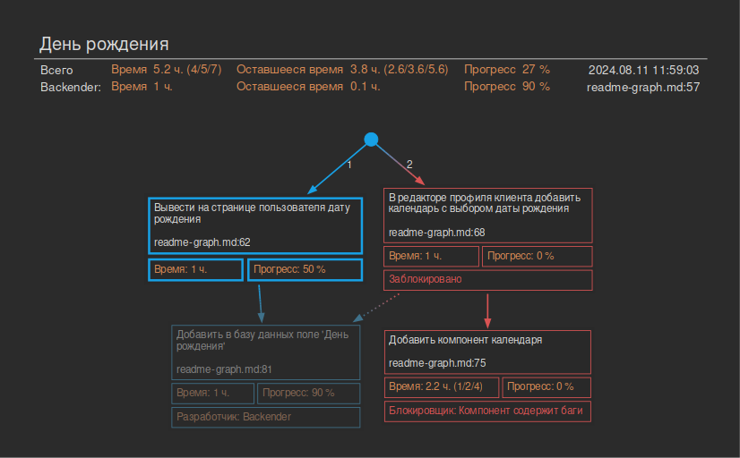
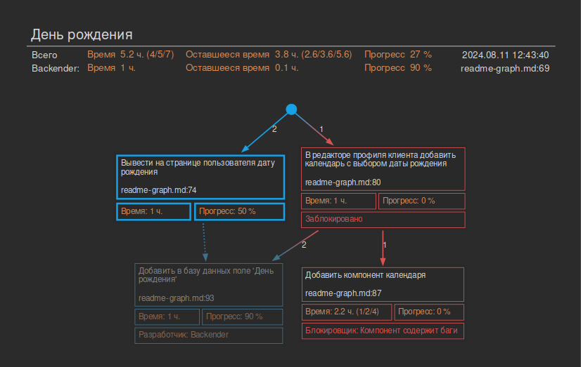

# Утилита plangraph

Утилита для построения диаграммы работ и сложного плана.

## Обзор

Подобно утилите planplain, plangraph основывается на комментариях, которые необходимо расположить в коде, в тех местах, где планируются изменения, необходимые для решения задачи.
Главное отличие plangraph от planplain в том, как формируется структура документа. В planplain документ формируется из комментариев, порядок которых определен в одном из параметров комментария. То есть planplain формирует документ из отсортированных по порядку пунктов.

В plangraph комментарий может указывать на другие комментарии, от выполнения которых он зависит, тем самым формируя сложную структуру. В общем случае такая структура является графом. Для графа строится остовное дерево, из которого формируется документ. Поскольку документ повторяет структуру дерева, то получается уже не плоский список, а структурированный документ с подпунктами.

При внесении изменений в существующий код комментарии располагаются в существующих файлах, если планируется новый файл - то создается новый файл и в нем пишутся комментарии. Для главного комментария лучше создать в корне проекта текстовый файл с именем типа plan.txt. В этот же файл можно поместить некоторые комментарии вроде "Написать тесты"

## Пример комментария

```
# TODO: PL: Create model Post         Маркер и текстовое описание
# ID: id-1                            ID комментария, произвольная уникальная строка.
# DEP: id-2                           ID комментария, от которого зависит данный комментарий
# TIME: 1                             Оценка времени выполнения, часы
# COMPL: 50                           Готовность в процентах
```

Строки с параметрами комментария должны идти последовательно, без пустых строк между ними или строк не являющихся параметрами комментария.

__[Пример документа](plan-graph-example.md)__

Диаграмма для этого документа (кликабельно):


## Запуск

В директории с рабочим проектом, в которой исходники с комментариями:

```
> python3 /path/to/workplan/plangraph.py -b [имя базовой ветви git]
```

Ниже в разделе __Параметры командной строки__ дано описание всех параметров

## Описание параметров комментария

Комментарий должен начинаться строкой вида:
 `# TODO: PL: Create model Post`

`TODO: PL:` - маркер, по которому утилита отличает целевой комментарий от прочих. Суффикс `PL` может быть переопределен с помощью аргумента командной строки `--todo-suffix SUFFIX` или соответствующей опции в конфигурационном файле.
За маркером следует текстовое описание того, что должно быть изменено в рамках данной части задачи.

Обязательный параметр.

`ID: id-1` - уникальный идентификатор комментария. Поскольку комментарии (части работы) связаны между собой зависимостями, то для построения таких зависимостей нужно чтоб комментарии могли ссылаться друг на друга. Именно для этого и используется поле ID. При использовании IDE создание ID можно автоматизировать и нет надобности прописывать их вручную.

Обязательный параметр.

Подробнее про использование IDE для упрощения работы с комментариями ниже.

`DEP: id-2` - Зависимость данного комментария от другого с ID=id-2. Например, часть работы "Вывести на экран дату рождения" зависит от части "Добавить в базу данных поле 'День рождения'". Строк с зависимостями может быть не одна.
Порядок перечисления зависимостей влияет на построение диаграммы и, особенно, документа. На диаграмме, рядом со стрелками соответствующими перечисленным зависимостям, отображаются числа обозначающие порядковый номер зависимости.
Необязательный параметр.

`TIME: id-2` - Оценка времени в часах. Может иметь простую форму: `TIME: 2`, или с оценкой  оптимистическое/ожидаемое/пессимистическое время `TIME: 1/2/8`.
При указании трёх значений общее время считается по формуле:
`(optimistic + 4 * expected + pessimistic)/6`

Обязательный параметр.

`COMPL: 50` - Оценка готовности блока в процентах.
При значении готовности более 0% узел на диаграмме отображается в жирной рамке.
При значении 90% узел отображается приглушенным (считаем, что 90% - блок почти сделан, но в конце работы нужно еще раз пробежаться по нему). При значении 100% - узел приглушается еще сильнее (считаем, что эта часть работы полностью выполнена).
Обязательный параметр.

`DEV: Имя разработчика` - Имя ответственного за часть работы.

Необязательный параметр.

`BLOCKER: Причина блокировки` - Отмечает, что часть работы заблокирована и не может быть выполнена.
На диаграмме отмечается красным с указанием причины, также красным отмечаются зависимые части.

Необязательный параметр.

Пример использования параметров:


```
# TODO: BD1: День рождения
# ID: MAIN
# DEP: id-2
# DEP: id-1

# TODO: BD1: Вывести на странице пользователя дату рождения
# ID: id-1
# DEP: id-4
# TIME: 1
# COMPL: 50

# TODO: BD1: В редакторе профиля клиента добавить календарь с выбором даты рождения
# ID: id-2
# DEP: id-3
# DEP: id-4
# TIME: 1
# COMPL: 0

# TODO: BD1: Добавить компонент календаря
# ID: id-3
# TIME: 1/2/4
# COMPL: 0
# BLOCKER: Компонент содержит баги

# TODO: BD1: Добавить в базу данных поле 'День рождения'
# ID: id-4
# TIME: 1
# COMPL: 90
# DEV: Backender
```


Сплошные стрелки на диаграмме образуют дерево, структура которого соответствует структуре документа.
Для диаграммы выше документ будет иметь следующую структуру:

> - Вывести на странице пользователя дату рождения
>   - Добавить в базу данных поле 'День рождения'
> - В редакторе профиля клиента добавить календарь с выбором даты рождения
>   - Добавить компонент календаря

Если изменить порядок зависимостей в комментарии MAIN

```
# TODO: PL: День рождения
# ID: MAIN
# DEP: id-2
# DEP: id-1

...
```
то диаграмма примет такой вид:



Теперь дерево изменилось и ему соответствует документ со следующей структурой:

> - В редакторе профиля клиента добавить календарь с выбором даты рождения
>   - Добавить компонент календаря
>   - Добавить в базу данных поле 'День рождения'
> - Вывести на странице пользователя дату рождения

### Главный комментарий

Главный комментарий - это вспомогательный комментарий, он не соответствует никакой части задачи и выполняет вспомогательные функции. Имеет три параметра: `TODO`, `ID`, `DEP`:

```
# TODO: PL: День рождения
# ID: MAIN
# DEP: id-2
# DEP: id-1
```

* содержит заглавие диаграммы и документа
* определяет блоки работ самого верхнего уровня и их порядок в документе

ID всегда `MAIN`. Такой комментарий должен быть всего один.
Разместить комментарий можно в корне проекта в файле с именем, например, `plan.txt`

Порядок перечисления зависимостей очень важен, он соответствует порядку блоков работ в документе и влияет на построение диаграммы.

## Параметры командной строки

```
-h
--help
```
Выводит на экран подсказку по параметрам командной строки.


```
-b branch-name
--base-branch branch-name
```

Комментарии ищутся не во всех файлах проекта, а в тех, что изменены, по сравнению с базовой веткой (чаще всего master или main). Этот параметр определяет имя базовой ветки git.

По умолчанию __master__

```
-o out-file.md
--output out-file.md
```

Имя файла для сгенерированного документа.

По умолчанию: __plan.md__

```
-p out-file.png
--out-graph out-file.png
```

Имя файла для сгенерированной диаграммы.

По умолчанию: __plan.png__


```
-s scale
--scale scale
```

Число, на которое будет умножено время при генерации документа. Например если в комментарии указано ожидаемое время 2 часа, а scale=2.5, то в документе будет указано 5 часов.

По умолчанию: __1__

```
-f SUFFIX
--todo-suffix SUFFIX
```

Маркер для TODO. По умолчанию ищутся комментарии вида: TODO: PL: .....
При необходимости PL можно переопределить, например для --todo-suffix PLAN комментарии будут вида: TODO: PLAN: .....

По умолчанию __PL__


```
-w hours
--work-hours hours
```

Кол-во часов в день, которое предполагается тратить на задачу. Влияет на подсчет кол-ва дней на задачу. Если не задано, то подсчет дней не производится.

Например для --work-hours 4 в документ будет выглядеть так

> __План задачи 1892-add-read-time-and-word-count__
>
> **Время: 9.0 ч. / 2 д. 1 ч.**
>
> **Готовность: 19 %**
>
> ..............

По умолчанию __не задано__

```
-v
--verbose
```

Если указан параметр то:
В консоль выводится дополнительная информация.

По умолчанию __не задано__

```
-d out_dir
--out-dir out_dir
```

Имя директории, в которую сохранять документ.

По умолчанию: __./__

```
--graph-dir tb|lr
```

Направление в котором строится граф на диаграмме: сверху-вниз или слева-направо.
* `tb` - сверху-вниз (по умолчанию)
* `lr` - слева-направо

```
-r
--reverse
```

Ключ, при указании которого направление стрелок на диаграмме будет инвертировано.

```
--exclude-extensions extensions
```

Список расширений файлов, в которых не следует искать комментарии. Например: `--exclude-extensions extensions=png,zip`

По умолчанию __не задано__


```
--h-start-level level
```

Начальный уровень заголовка в документе (\<H1>\</H1>, \<H2>\</H2>, ...):

По умолчанию: __1__


```
--git-binary-path /path/to/git
```

Путь к бинарнику git

По умолчанию: __git__

```
----dot-binary-path /path/to/dot
```

Путь к бинарнику __dot__. __dot__ - программа из состава пакета __graphviz__

По умолчанию: __git__


```
--src file_name
```

Искать комментарии только в указанном файле. Используется для тестирования и отладки.

По умолчанию: __не задано__


### Конфигурационный файл

Что бы каждый раз не указывать опции командной строки, в директорию с проектом можно положить файл __.plan.conf__, в котором указать те же опции:

```
[MAIN]
base_branch = main
scale = 1
todo_suffix = PL
work_hours = 4
verbose = 0
```

Образец файла можно найти [тут](../.plan.conf).


## Советы по использованию

Для ускорения ввода можно использовать шаблоны, которые поддерживаются всеми основными IDE.


Пример настройки для продуктов JetBrains:


Для навигации удобно использовать встроенные или установленные как дополнение в IDE списки  TODO с фильтрацией по маркеру PL


Если в IDE запустить утилиту во встроенном терминале, то можно легко перемещаться по TODO с помощью вывода утилиты в консоль


