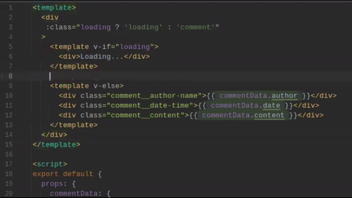
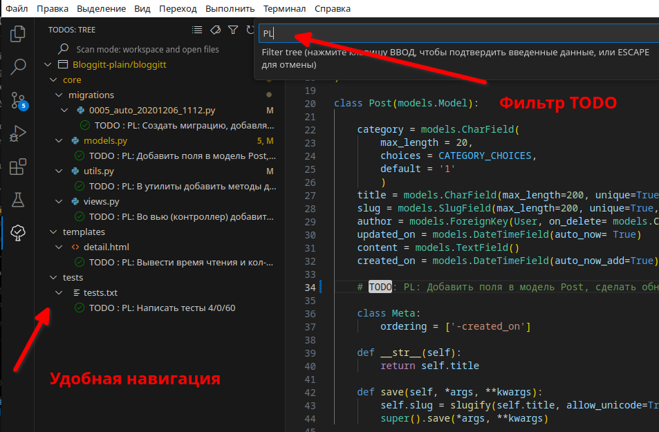
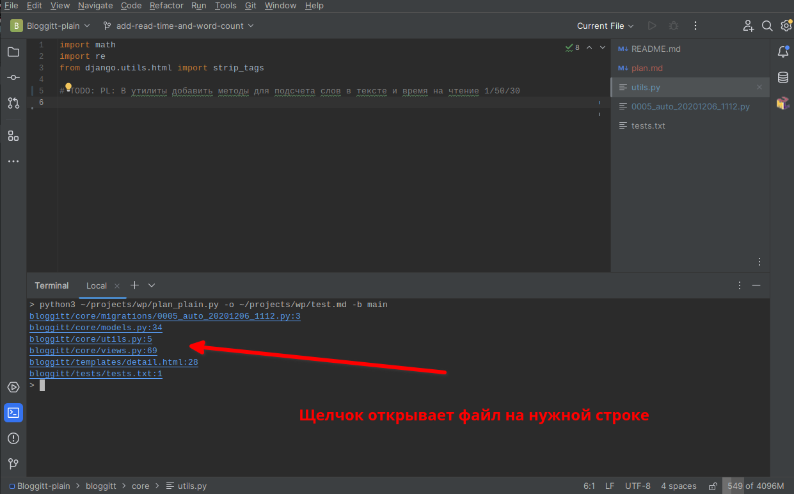

# Утилита planplain

Утилита для построения простого плоского плана.

## Пример комментария

```
TODO: PL: Добавить поля в модель Post 0.5/0/10
```

Описание:

```
TODO: PL: Добавить поля в модель Post 0.5/0/10
_________ ___________________________ ________________________________________
Маркер    описание                    время/готовность/положение в документе
```

__Пример документа__

> __Read time counter__
>
> **время: 8 ч.**
>
> **оставшееся время: 6.5 ч.**
>
> **прогресс: 18 %**
>
> 2024.08.10 14:14:14
>
> ####  ~~создать миграцию, добавляющую счетчик слов и прочтений~~
> -  ~~файл: bloggitt/core/migrations/0005_auto_20201206_1112.py:3~~
> -  ~~время: 0.5 ч.~~
> -  ~~прогресс: 100 %~~
> #### добавить поля в модель post, сделать обновление счетчиков при сохранении контента
> - файл: bloggitt/core/models.py:34
> - время: 1 ч.
> - прогресс: 50 %
> #### в утилиты добавить методы для подсчета слов в тексте и время на чтение
> - файл: bloggitt/core/utils.py:5
> - время: 1 ч.
> - прогресс: 50 %
> #### во вью (контроллер) добавить код увеличивающий счетчик просмотров поста
> - файл: bloggitt/core/views.py:69
> - время: 0.5 ч.
> - прогресс: 0 %
> #### вывести время чтения и кол-во просмотров
> - файл: bloggitt/templates/detail.html:28
> - время: 1 ч.
> - прогресс: 0 %
> #### написать тесты
> - файл: bloggitt/tests/tests.txt:1
> - время: 4 ч.
> - прогресс: 0 %

Последовательность пунктов в документе определяется в соответствии с параметром "порядок" в комментарии. В документе выводится текст комментария, место где он определен, время и прогресс. Вначале документа заголовок, общее время и прогресс, дата создания.

Пункты, имеющие готовность 100% зачеркиваются.

## Запуск

В директории с рабочим проектом, в которой исходники с комментариями:

```
> python3 /path/to/wp/planplain.py -b [имя базовой ветви git]
```

### Параметры командной строки

```
-h
--help
```
Выводит на экран подсказку по параметрам командной строки.


```
-b branch-name
--base-branch branch-name
```

Комментарии ищутся не во всех файлах проекта, а в тех, что изменены, по сравнению с базовой веткой (чаще всего master или main). Этот параметр определяет имя базовой ветки git.
По умолчанию __master__

```
-o out-file.md
--output out-file.md
```

Имя файла для сгенерированного документа.
По умолчанию: __plan.md__

```
-t title
--title title
```

Заголовок документа, название задачи.
По умолчанию __имя текущей ветки git__

```
-s scale
--scale scale
```

Число, на которое будет умножено время при генерации документа. Например если в комментарии указано ожидаемое время 2 часа, а scale=2.5, то в документе будет указано 5 часов.
По умолчанию: __1__

```
-f PL
--todo-suffix PL
```

Маркер для TODO. По умолчанию ищутся комментарии вида: TODO: PL: .....
При необходимости PL можно переопределить, например для --todo-suffix PLAN комментарии будут вида: TODO: PLAN: .....
По умолчанию __PL__


```
-w hours
--work-hours hours
```

Кол-во часов в день, которое предполагается тратить на задачу. Влияет на подсчет кол-ва дней на задачу. Если не задано, то подсчет дней не производится.

Например для --work-hours 4 в документ будет выглядеть так

> __План задачи 1892-add-read-time-and-word-count__
>
> **Время: 9.0 ч. / 2 д. 1 ч.**
> **Готовность: 19 %**
> ..............

По умолчанию __не задано__

```
-v
--verbose
```

Если указан параметр то:
В консоль выводится дополнительная информация.

По умолчанию __не задано__

```
-d out_dir
--out-dir out_dir
```

Имя директории, в которую сохранять документ.

По умолчанию: __./__


```
--exclude-extensions extensions
```

Список расширений файлов, в которых не следует искать комментарии. Например: `--exclude-extensions extensions=png,zip`

По умолчанию __не задано__


```
--h-start-level level
```

Начальный уровень заголовка в документе (\<H1>\</H1>, \<H2>\</H2>, ...):

По умолчанию: __1__


```
--git-binary-path /path/to/git
```

Путь к бинарнику git

По умолчанию: __git__


```
--src file_name
```

Искать комментарии только в указанном файле. Используется для тестирования и отладки.

По умолчанию: __не задано__


### Конфигурационный файл

Что бы каждый раз не указывать опции командной строки, в директорию с проектом можно положить файл __.planplain.conf__, в котором указать те же опции:

```
[MAIN]
base_branch = main
title = TASK-1234
scale = 1
todo_suffix = PL
work_hours = 4
verbose = 0
```

Образец файла можно найти [тут](.plan.conf).

## Советы по использованию

Для ускорения ввода можно использовать шаблоны, которые поддерживаются всеми основными IDE.



Для навигации удобно использовать встроенные или установленные как дополнение в IDE списки  TODO с фильтрацией по маркеру PL



Если в IDE Idea запустить утилиту во встроенном терминале, то можно легко перемещаться по TODO с помощью вывода утилиты в консоль


