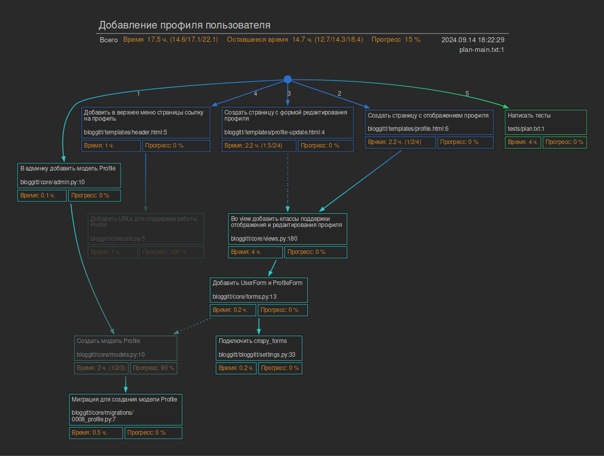

# Утилита План

Утилита, предназначенная для разработчиков и лидов для анализа и декомпозиции задачи, оценки её сложности и построения документа с планом работ и ходом выполнения.

## Концепция

### Проблема

80% задач выполняется с опозданием (какое-то исследование).

Некоторые причины:
* Недостаточно хороший анализ задачи, как следствие неучтённые детали и непредвиденные сложности.
* Оценка задачи "на глаз" - ошибочная, мы часто переоцениваем себя и недооцениваем задачу.

### Решение

Анализ. Перед началом кодинга, получить документ, составление которого требовало-бы провести глубокий анализ задачи. То есть исследовательскую часть задачи сдвинуть вперед по времени, а сам кодинг сдвинуть назад, убрав чередование анализ-кодинг-анализ-кодинг-... , оставив один цикл анализ-кодинг.

Оценка. Человек плохо оценивает сложные вещи, точнее оценивает простые. Не оценивать задачу целиком, а разбить на маленькие кусочки, которые можно оценить "на глаз" более-менее точно. Сумму маленьких оценок сложить и получить общий результат.

### Реализация

Читаем постановку задачи, думаем как будем решать, затем идём в проект и ищем те места в коде, которые предстоит изменить. С помощью специального вида TODO-комментариев отмечаем места в коде, которые предстоит изменить. Каждому такому изменению указываем параметры: небольшое текстовое описание, оценку в часах, и ряд других. Запускаем утилиту, которая сканирует файлы, собирает комментарии и из них строит документ и считает оценку.

Есть два варианта утилиты: для простых задач и сложных. Для простых задач меньше дополнительных параметров, для больших - больше. Ниже об этом будет подробнее.

В дальнейшем простая утилита будет именоваться как __plan-plain__, а сложная - __plan-graph__.

## [plan-plain](doc/readme-plain.md)

Простой плоский план, подходит для совсем простых задач.

Пример комментария:

```
TODO: PL: Добавить поля в модель Post 0.5/0/10
```

Пояснение:

```
TODO: PL:   Добавить поля в модель Post   0.5/0/10
__________  ____________________________  ___________________________________________________
Маркер      Описание                      Время/готовность/положение в документе (сортировка)
```

Отметив в коде места, подлежащие изменению, запускаем утилиту. Она соберет эти комментарии вместе, сформирует документ и выполнит подсчет времени и готовность задачи.

__[Пример документа](doc/plan-plain-example.md)__

В документе перечислены комментарии, соответствующие маркеру `TODO: PL:`. Время, готовность и положение (порядок сортировки) в документе берутся из второй части комментария `0.5/0/10`, имя файла - из имени файла, в котором расположен комментарий.

Такого рода простой план хорошо подходит для небольших задач. Может использоваться, на пример, как руководство, для джуна от разработчика постарше. То есть, план сформировал старший разработчик, коротко указал что и где делать, и отдал для выполнения младшему разработчику. Далее джун с помощью документа информирует о ходе работы.

Процесс может выглядеть так (но не обязательно именно так): синьор создал тематическую ветку, проанализировал задачу, прописал комментарии, передал ветку джуну. Джун с помощью IDE видит TODO, по ним ориентируется, что где делать. По мере продвижения работы джун меняет у комментариев прогресс выполнения и информирует старшего разработчика о ходе работы с помощью документа.

[Подробное описание plan-plain](doc/readme-plain.md)

## [plan-graph](doc/readme-graph.md)

__plain-plan__ - прост и наивен и не очень хорошо подходит для сложных задач.

Для крупных задач важно не только найти места для изменения, но и выявить зависимости между ними. При построении зависимостей между частями задачи выявляются неучтенные места о которых сразу и не подумалось. Так задача лучше прорабатывается на раннем этапе и на пути к решению будет меньше сюрпризов.

__plan-graph__ позволяет строить не только документ, но и графическую диаграмму, которая наглядно представляет план работы. Эта диаграмма позволяет визуально оценить зависимости между частями, оценить качество проработки задачи, выстроить последовательность работ и контролировать их ход, в том числе для себя лично. Когда задача большая, бывает уже и сам забыл что сделано, а что еще надо доделать.

Пример диаграммы (кликабельно):



Для анализа, построения диаграммы и документа требуются комментарии такого вида:

```
# TODO: PL: Добавить UserForm и ProfileForm
# ID: bloggitt/core/forms.py:13
# DEP: bloggitt/core/models.py:10
# DEP: bloggitt/bloggitt/settings.py:33
# TIME: 0.25
# COMPL: 50
```

Тут:

* `TODO: PL: Добавить UserForm и ProfileForm` маркер и описание
* `ID: bloggitt/core/forms.py:13` уникальный ID комментария (произвольная строка)
* `DEP: bloggitt/core/models.py:10` ID другого комментария. От которого зависит данный блок работ
* `TIME: 0.25` Оценка времени в часах
* `COMPL: 50` Оценка готовности в процентах

[Подробное описание plan-graph](doc/readme-graph.md)

## [purgen](doc/readme-purgen.md)

Утилита, которая удаляет из кода комментарии.

## Установка

```
git clone https://github.com/stg34/wp.git
```

### Зависимости

Для работы требуется установленный __git__.

Для утилиты __plan-graph__ требуется установленный [graphviz](https://graphviz.org/download/) (нужен для построения диаграммы)


## Запуск

В __директории с рабочим проектом__, в которой исходники с комментариями:

```
> python3 /path/to/workplan/planplain.py -b master    # для простого плана
> python3 /path/to/workplan/plangraph.py -b master    # для сложного плана
> python3 /path/to/workplan/purgen.py -b master       # очистка кода от комментариев
```

Параметр `-b [имя базовой ветви git]` обязательный. Это имя ветки, куда будет в конце влита задача. Чаще всего __master__ или __main__, но может зависеть от принятых правил разработки.
Утилита ищет комментарии только в тех файлах, которые изменены по сравнению с базовой. Например, если тематическая ветка была отпочкована от __master__, то и указывать надо __master__
